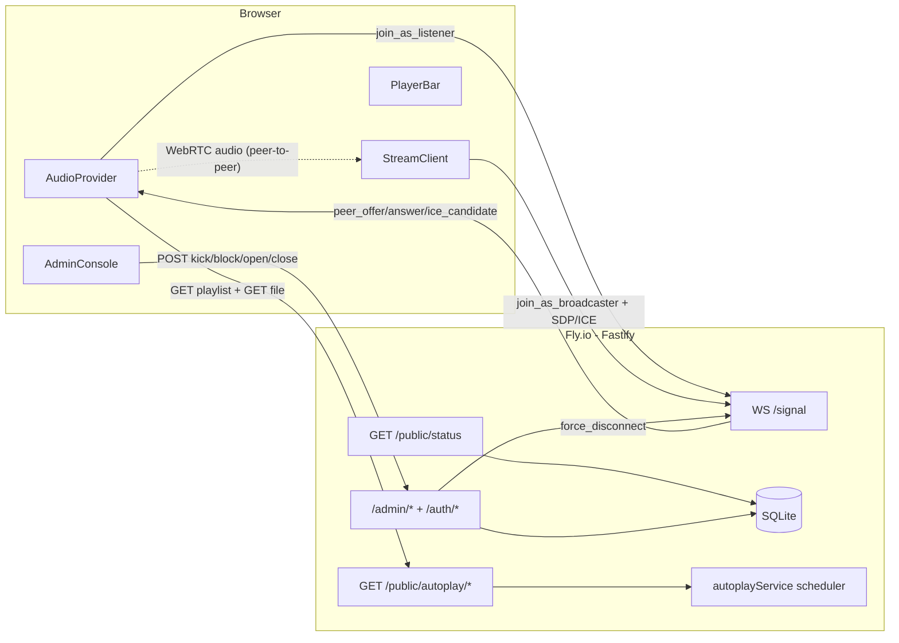
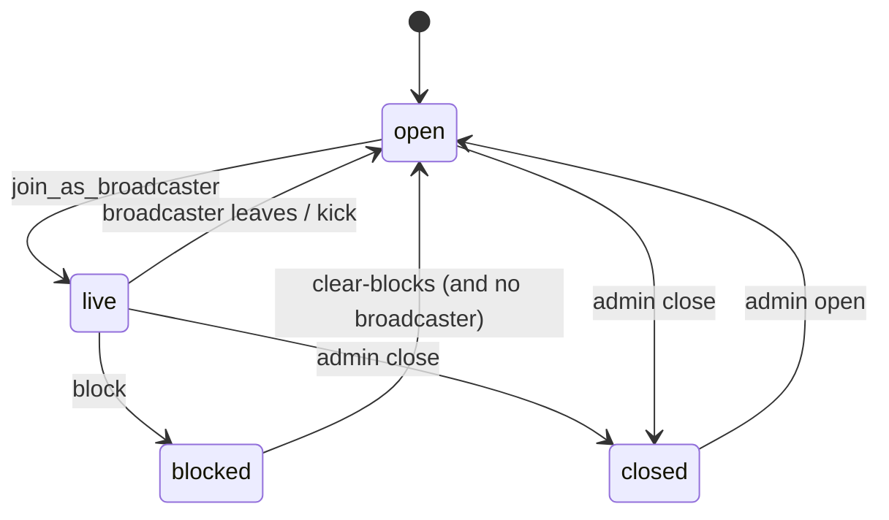

# Architecture

West Port Radio is a small-scale internet radio station with two listening modes:

1. **Always-on jukebox** — when nobody is broadcasting live, every browser plays the same MP3 from the repo's `songs/` directory, seeked to the same offset so all listeners hear the same moment.
2. **Live WebRTC broadcast** — exactly one user can "jack" the station from their browser at `/stream`, allow the mic, and become the broadcaster. The Fastify API relays SDP/ICE over a WebSocket; audio itself flows browser-to-browser.

The design is deliberately small: one Fastify process on Fly.io with a SQLite file on a persistent volume, plus a Next.js front-end on Vercel.

---

## Components

| Path | Role |
|---|---|
| `apps/web` | Next.js 15 App Router. Single global [`AudioProvider`](../apps/web/src/lib/AudioProvider.tsx) drives audio for every page. Persistent [`PlayerBar`](../apps/web/src/components/PlayerBar.tsx) survives navigation. `/stream` lets one user broadcast. `/admin` gates kick/block/open/close behind a cookie session. |
| `apps/api` | Fastify 5. State machine in [`liveRoomService.ts`](../apps/api/src/services/liveRoomService.ts), playlist scheduler in [`autoplayService.ts`](../apps/api/src/services/autoplayService.ts), `/signal` WebSocket, REST endpoints, Swagger UI at `/docs`. |
| `packages/shared` | TypeScript types + Zod schemas shared by web and api. Anything on the wire (`StationStatus`, `SignalClientMessage`, `SignalServerMessage`) lives here. |
| `songs/` | The fallback playlist. Files are filtered by extension allowlist and a safe-name regex before being served. |
| `infra/local/` | Optional Docker compose for an Icecast + Liquidsoap "classic" stream. Not required if you only use the in-repo autoplay + WebRTC. |
| `fly.toml` | Canonical Fly.io config (single source of truth as of Phase 2). |

---

## High-level data flow



---

## Station state machine

The persistent column `stream_state.station_state` is the single source of truth. Values:

| State | Meaning |
|---|---|
| `open` | No live broadcaster. Listeners hear the always-on jukebox. Anyone can `join_as_broadcaster`. |
| `live` | A broadcaster is attached. Listeners attempt WebRTC; until handshake completes, they continue on the jukebox. |
| `closed` | Admin has closed the station. New broadcasters are rejected with "stream is closed". |
| `blocked` | Last broadcaster was blocked. Their peer id is in `blocked_peers`. New broadcasters may still try; they're rejected if their peer id is in the blocklist. |
| `degraded` | Reserved for future use (e.g. the `songs/` directory is missing). Currently never set. |



Recovery rules in [`liveRoomService.ts`](../apps/api/src/services/liveRoomService.ts):

- `initializeStationService()` runs on boot. If the DB shows `live` from a previous run, the session is marked `ended` and state flips to `open`.
- `normalizeState()` runs before every read. If the broadcaster's WebSocket is gone, the broadcaster_peer_id is cleared regardless of the current state (Phase 2 broadened this from the previous `live`-only behavior).

---

## Signaling protocol

WebSocket `/signal` is the only socket. Message shapes are defined as discriminated unions in [`packages/shared/src/types/liveRoom.ts`](../packages/shared/src/types/liveRoom.ts):

- Client → server: `join_as_listener`, `join_as_broadcaster`, `sdp_offer`, `sdp_answer`, `ice_candidate`, `leave`.
- Server → client: `station_status`, `listener_accepted`, `broadcaster_accepted`, `broadcaster_rejected`, `peer_offer`, `peer_answer`, `ice_candidate`, `force_disconnect`.

### Listener handshake

```mermaid
sequenceDiagram
  participant L as Listener
  participant API as Fastify /signal
  participant B as Broadcaster
  L->>API: WS connect
  API-->>L: station_status (alwaysOnState)
  L->>API: join_as_listener {peerId}
  API-->>L: listener_accepted
  Note over L: plays jukebox until broadcaster shows up
  API-->>L: station_status (broadcasterPresent=true, broadcasterPeerId)
  L->>API: sdp_offer (target=broadcaster)
  API->>B: peer_offer (from=listener)
  B->>API: sdp_answer (target=listener)
  API->>L: peer_answer
  par ICE trickle (either direction; buffered if it races SDP)
    L->>API: ice_candidate
    API->>B: ice_candidate
  and
    B->>API: ice_candidate
    API->>L: ice_candidate
  end
  Note over L,B: WebRTC peer connection is established<br/>audio flows browser-to-browser, not through Fly
```

ICE candidates that arrive before the matching SDP are illegal to add. Both ends buffer them:

- Listener side ([`AudioProvider.tsx`](../apps/web/src/lib/AudioProvider.tsx)) — `pendingIceRef[]` drained after `setRemoteDescription`.
- Broadcaster side ([`StreamClient.tsx`](../apps/web/src/components/StreamClient.tsx)) — per-listener `earlyIceRef` plus per-peer `entry.pendingIce` drained after the offer arrives.

### Bad-payload tolerance

A single malformed JSON or a relay against a peer that has just disappeared must never tear down the WebSocket. `parseMessage()` returns null on bad JSON; `relaySignal()` errors are swallowed in `handleSignalMessage`. The client recovers via the next `station_status`.

---

## Persistence boundaries

What survives a restart vs what doesn't:

| Data | Storage | Survives restart? |
|---|---|---|
| `stream_state` (current state, broadcaster id, session id) | SQLite | yes (Fly volume) |
| `sessions` (broadcaster session log) | SQLite | yes |
| `blocked_peers` | SQLite | yes |
| `audit_log` (admin actions) | SQLite | yes (trimmed to last 1000 hourly — Phase 4) |
| Connected WebSocket sockets | RAM | no |
| `RTCPeerConnection` instances | RAM (browser) | no |
| Always-on scheduler `{trackIndex, startedAt}` | RAM (`autoplayService.ts` module-level) | **no — known limitation, see claims.yaml#always-on-restart-resets** |
| Listener peer id | `localStorage` (browser) | yes |
| Chat messages | `sessionStorage` (browser) | no — single-tab, ephemeral |

---

## Deployment topology

| Surface | Host | Trigger | Config |
|---|---|---|---|
| Web | Vercel | **Automatic** on push to `main` (project root: `apps/web`) | [`apps/web/vercel.json`](../apps/web/vercel.json), [`next.config.js`](../apps/web/next.config.js) |
| API | Fly.io | **Manual** via `fly deploy` from `wst-prt-radio/` | [`fly.toml`](../fly.toml), [`apps/api/Dockerfile`](../apps/api/Dockerfile) |

Fly machines run `min_machines_running = 1, auto_stop_machines = false` so WebRTC sessions don't die under cold start. The SQLite file lives on a Fly volume mounted at `/data`.

Required env / secrets in production:

- `APP_ENV=production`
- `PORT=3001`
- `SQLITE_DB_PATH=/data/wstprtradio.db`
- `STATION_NAME=West Port Radio`
- `CORS_ALLOWED_ORIGINS=https://your-vercel-app.vercel.app[,https://wstprtradio.com]`
- `SESSION_SECRET=<random 32-byte hex>` — required in prod (Phase 3)
- `ADMIN_USERS=marco:<password>,mun:<password>` — required in prod (Phase 3)

Vercel-side env (front-end):

- `NEXT_PUBLIC_API_BASE_URL=https://<your-fly-app>.fly.dev`
- `NEXT_PUBLIC_PUBLIC_SITE_URL=https://<your-vercel-app>.vercel.app`

---

## Authentication (Phase 3)

| Surface | Auth |
|---|---|
| `GET /health` | none |
| `GET /ready` | none (cheap DB ping) |
| `GET /public/*`, `WS /signal` | none |
| `POST /auth/login`, `POST /auth/logout`, `GET /auth/me` | none for login itself; `/auth/me` returns 401 when no session |
| `GET /admin/*`, `POST /admin/*` | requires cookie session (set by `/auth/login`) |

Sessions are server-side, signed cookies via `@fastify/cookie` + `@fastify/session`. Passwords are hashed in memory at boot from `ADMIN_USERS` (format: `username:password,username:password`). The default seed `marco:barkbark,mun:woofwoof` only applies in development; production must supply `ADMIN_USERS` via Fly secrets.

---

## Observability

- `GET /health` — cheap liveness, no DB. Used by Fly `[[http_service.checks]]`.
- `GET /ready` — readiness, runs `SELECT 1` and returns the public station status.
- Fastify Pino logs — pretty in dev, JSON in prod.
- `audit_log` table — every admin action with actor (real username from cookie session) + entity + JSON payload. Trimmed to the last 1000 entries hourly (Phase 4).

---

## Scaling ceiling

The broadcaster forms a full mesh: one `RTCPeerConnection` per listener, with the broadcaster uplinking the same Opus stream to every peer. Practical ceiling on a residential connection is ~10–20 listeners before the broadcaster's upload saturates. Beyond that the upgrade path is an SFU (mediasoup, LiveKit, Cloudflare Calls); the Fastify signaling layer would need to become an SFU client.

The `/signal` WebSocket itself is single-process and in-memory. With one Fly machine that's fine; horizontal scale would require a shared state store (Redis pub/sub) and broadcaster-affinity routing.

---

## Future DB schema (Postgres / Supabase target)

The current SQLite schema is intentionally small. When the station moves to a hosted Postgres (likely Supabase) for chat history + a real song catalog, today's tables (`stream_state`, `sessions`, `blocked_peers`, `audit_log`) port 1-to-1. New tables sketched here for forward compatibility:

```sql
CREATE TABLE users (
  id              uuid PRIMARY KEY DEFAULT gen_random_uuid(),
  username        text UNIQUE NOT NULL,
  display_name    text,
  role            text NOT NULL CHECK (role IN ('admin', 'listener')),
  password_hash   text,
  created_at      timestamptz NOT NULL DEFAULT now()
);

CREATE TABLE chat_messages (
  id                   uuid PRIMARY KEY DEFAULT gen_random_uuid(),
  user_id              uuid REFERENCES users(id),
  anon_handle          text,
  peer_id              text,
  body                 text NOT NULL,
  created_at           timestamptz NOT NULL DEFAULT now(),
  deleted_at           timestamptz,
  deleted_by_user_id   uuid REFERENCES users(id)
);

CREATE TABLE songs (
  id            uuid PRIMARY KEY DEFAULT gen_random_uuid(),
  filename      text UNIQUE NOT NULL,
  sha256        text UNIQUE NOT NULL,
  title         text,
  artist        text,
  album         text,
  duration_ms   integer,
  mime_type     text NOT NULL,
  path          text NOT NULL,
  added_at      timestamptz NOT NULL DEFAULT now()
);

CREATE TABLE play_history (
  id                      uuid PRIMARY KEY DEFAULT gen_random_uuid(),
  song_id                 uuid REFERENCES songs(id),
  broadcaster_peer_id     text,
  started_at              timestamptz NOT NULL,
  ended_at                timestamptz
);
```

Migration plan when we move:

1. Stand up Supabase / Postgres.
2. Replace `apps/api/src/db/client.ts` with a `pg` (or `postgres-js`) client; keep the same query shapes.
3. Run a one-time export of `audit_log` and `sessions` from SQLite into Postgres for history.
4. The admin user list moves from `ADMIN_USERS` env into the `users` table; the auth path swaps from "verify against in-memory hash map" to "verify against `users.password_hash`".

Until then, chat is browser-local (`sessionStorage` in [`ChatPanel.tsx`](../apps/web/src/components/ChatPanel.tsx)) and the song catalog is "whatever's in `songs/` at deploy time."

---

## Where to look first

- **Signal server** — [`apps/api/src/services/liveRoomService.ts`](../apps/api/src/services/liveRoomService.ts)
- **Always-on scheduler** — [`apps/api/src/services/autoplayService.ts`](../apps/api/src/services/autoplayService.ts)
- **Listener audio engine** — [`apps/web/src/lib/AudioProvider.tsx`](../apps/web/src/lib/AudioProvider.tsx)
- **Broadcaster UI** — [`apps/web/src/components/StreamClient.tsx`](../apps/web/src/components/StreamClient.tsx)
- **Admin UI** — [`apps/web/src/components/AdminConsole.tsx`](../apps/web/src/components/AdminConsole.tsx)
- **Shared wire types** — [`packages/shared/src/types/`](../packages/shared/src/types/)
- **OpenAPI** — [`apps/api/openapi.yaml`](../apps/api/openapi.yaml)
- **Operational runbook** — [`docs/runbook.md`](runbook.md)
- **Truth audit** — [`docs/claims.yaml`](claims.yaml)
